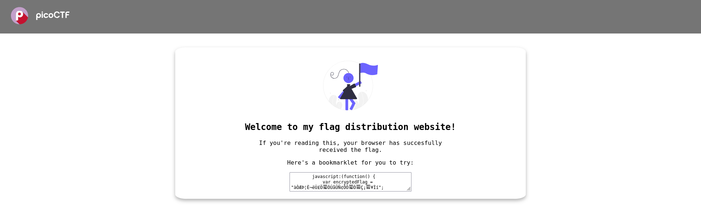
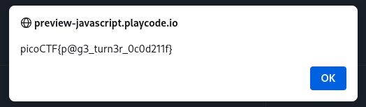

# :briefcase: Bookmarklet

- **Difficultly**: `Easy`
- **Category**: `Web Exploitation`
- **Platform**: `picoCTF 2024`
- **Tag**: `obfuscation` `browser_webshell_solvable` `browser`
- **Author**: `Jeffery John`
- **Date**: `27/05/2025`

---

# :pencil: Description

Why search for the flag when I can make a bookmarklet to print it for me? Browse here, and find the flag!

---

# :unlock: Solution

1. Access the link

    

2. Pay attention to the `javascript` snippet`>` Copy it

    ```js
        javascript:(function() {
            var encryptedFlag = "àÒÆަȬëÙ£Ö�ÓÚåÛÑ¢ÕÓ�Ó�Ç¡�¥Ìí";
            var key = "picoctf";
            var decryptedFlag = "";
            for (var i = 0; i < encryptedFlag.length; i++) {
                decryptedFlag += String.fromCharCode((encryptedFlag.charCodeAt(i) - key.charCodeAt(i % key.length) + 256) % 256);
            }
            alert(decryptedFlag);
        })();
    ```

3. Run

    

---

# :white_flag: Flag

> picoCTF{p@g3_turn3r_0c0d211f}

---

# :writing_hand: Notes

`None`

---

# :books: Resources

- [JavaScript - Wikipedia](https://vi.wikipedia.org/wiki/JavaScript)
- [JavaScript | MDN](https://developer.mozilla.org/en-US/docs/Web/JavaScript)

---

# :hammer_and_wrench: Tools used

[JavaScript Playground](https://playcode.io/javascript)

