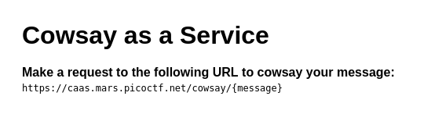
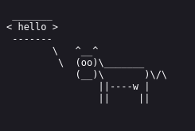
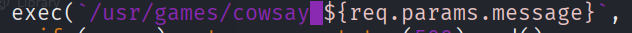
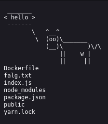
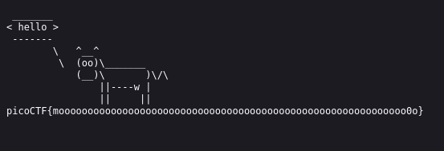

# :briefcase: caas

- **Difficulty**: `Medium`
- **Category**: `Web Exploitation`
- **Platform**: `picoMini by redpwn`
- **Tag**: `None`
- **Author**: `BrownieInMotion`
- **Date**: `04/07/2025`

---

# :pencil: Description

Now presenting [cowsay as a service](https://play.picoctf.org/practice/challenge/202)

---

# :unlock: Solution

1. Access the link

    

2. Following the instructions, I tried writing a message `>` I got this 

    

3. I downloaded the source code and read through it `>` I noticed this line

    

4. It seems that when I send a request, the `message` part gets passed into a program called `cowsay` `>` Since it's part of a command, we can terminate the original command and execute a new one using a `semicolon (;)` `>` So I tried it with the `ls` command

    

    And read the contents of the flag.txt file with the `cat` command

    

---

# :white_flag: Flag

> picoCTF{moooooooooooooooooooooooooooooooooooooooooooooooooooooooooooo0o}

---

# :writing_hand: Notes

In shell scripting, the `semicolon` (;) serves as a command separator. It allows for the execution of multiple commands sequentially on a single line.

---

# :books: Resources

`None`

---

# :hammer_and_wrench: Tools used

`None`

