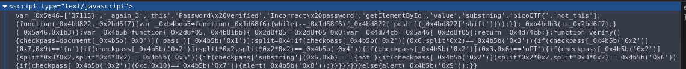
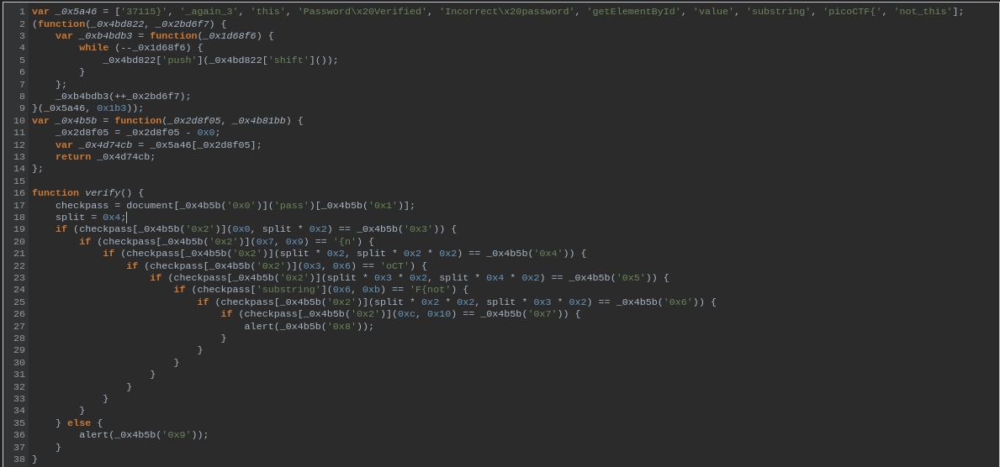

# :briefcase: Client-side-again

- **Difficulty**: `Medium`
- **Category**: `Web Exploitation`
- **Platform**: `picoCTF 2019`
- **Tag**: `None`
- **Author**: `Danny`
- **Date**: `21/06/2025`

---

# :pencil: Description

Can you break into this super secure portal? https://jupiter.challenges.picoctf.org/problem/56816/ [(link)](https://play.picoctf.org/practice/challenge/69) or http://jupiter.challenges.picoctf.org:56816

---

# :unlock: Solution

1. Access the link

    

2. Inspect this page `>` We have the `Javascript` code here

    

3. Remake and we get this

    

4. Analysis

    ```js
    var _0x5a46 = ['37115}', '_again_3', 'this', 'Password\x20Verified', 'Incorrect\x20password', 'getElementById', 'value', 'substring', 'picoCTF{', 'not_this'];
    (function(_0x4bd822, _0x2bd6f7) {
        var _0xb4bdb3 = function(_0x1d68f6) {
            while (--_0x1d68f6) {
                _0x4bd822['push'](_0x4bd822['shift']());
            }
        };
        _0xb4bdb3(++_0x2bd6f7);
    }(_0x5a46, 0x1b3));
    ```

    It will `shift` the elements of array `_0x5a46` 435 times and we get this

    ```js
    [
        'getElementById',      // [0]
        'value',               // [1]
        'substring',           // [2]
        'picoCTF{',            // [3]
        'not_this',            // [4]
        '37115}',              // [5]
        '_again_3',            // [6]
        'this',                // [7]
        'Password Verified',   // [8]
        'Incorrect password'   // [9]
    ]
    ```

    ```js
    var _0x4b5b = function(_0x2d8f05, _0x4b81bb) {
        _0x2d8f05 = _0x2d8f05 - 0x0;
        var _0x4d74cb = _0x5a46[_0x2d8f05];
        return _0x4d74cb;
    };
    ```

    Used to get element from array _0x5a46[] and below code will check the password

    ```js
    function verify() {
        checkpass = document[_0x4b5b('0x0')]('pass')[_0x4b5b('0x1')];
        split = 0x4;
        if (checkpass[_0x4b5b('0x2')](0x0, split * 0x2) == _0x4b5b('0x3')) {
            if (checkpass[_0x4b5b('0x2')](0x7, 0x9) == '{n') {
                if (checkpass[_0x4b5b('0x2')](split * 0x2, split * 0x2 * 0x2) == _0x4b5b('0x4')) {
                    if (checkpass[_0x4b5b('0x2')](0x3, 0x6) == 'oCT') {
                        if (checkpass[_0x4b5b('0x2')](split * 0x3 * 0x2, split * 0x4 * 0x2) == _0x4b5b('0x5')) {
                            if (checkpass['substring'](0x6, 0xb) == 'F{not') {
                                if (checkpass[_0x4b5b('0x2')](split * 0x2 * 0x2, split * 0x3 * 0x2) == _0x4b5b('0x6')) {
                                    if (checkpass[_0x4b5b('0x2')](0xc, 0x10) == _0x4b5b('0x7')) {
                                        alert(_0x4b5b('0x8'));
                                    }
                                }
                            }
                        }
                    }
                }
            }
        } else {
            alert(_0x4b5b('0x9'));
        }
    }
    ```

5. Compare elements to get flag

    

---

# :white_flag: Flag

> picoCTF{not_this_again_337115}

---

# :writing_hand: Notes

- The `substring()` method of String values returns the part of this string from the start index up to and excluding the end index, or to the end of the string if no end index is supplied.
- The `shift()` method of Array instances removes the first element from an array and returns that removed element. This method changes the length of the array.
- The `push()` method of Array instances adds the specified elements to the end of an array and returns the new length of the array.

---

# :books: Resources

- [String.prototype.substring() - JavaScript | MDN](https://developer.mozilla.org/en-US/docs/Web/JavaScript/Reference/Global_Objects/String/substring)
- [Array.prototype.shift() - JavaScript | MDN](https://developer.mozilla.org/en-US/docs/Web/JavaScript/Reference/Global_Objects/Array/shift)
- [Array.prototype.push() - JavaScript | MDN](https://developer.mozilla.org/en-US/docs/Web/JavaScript/Reference/Global_Objects/Array/push)

---

# :hammer_and_wrench: Tools used

[Online JavaScript beautifier](https://beautifier.io/)

