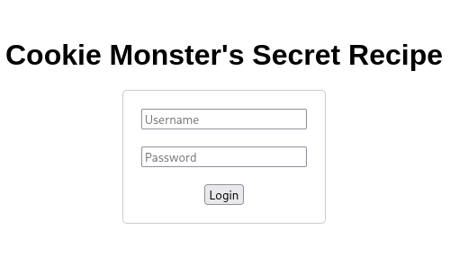
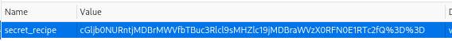
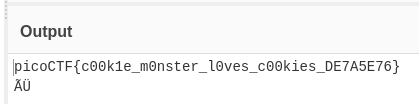

# :briefcase: Cookie Monster Secret Recipe

- **Difficultly**: `Easy`
- **Category**: `Web Exploitation`
- **Platform**: `picoCTF 2025`
- **Tag**: `browser_webshell_solvable`
- **Author**: `Brhane Giday and Prince Niyonshuti N.`
- **Date**: `20/05/2025`

---

# :pencil: Description

Cookie Monster has hidden his top-secret cookie recipe somewhere on his website. As an aspiring cookie detective, your mission is to uncover this delectable secret. Can you outsmart Cookie Monster and find the hidden recipe? You can access the Cookie Monster [here](https://play.picoctf.org/practice/challenge/469) and good luck

---

# :unlock: Solution

1. Access the link

    

2. Inspect the website cookies

    

3. We found a key named `secret_recipe` with a value that seems to be in Base64 format `>` Decode it

    

---

# :white_flag: Flag

> picoCTF{c00k1e_m0nster_l0ves_c00kies_DE7A5E76}

---

# :writing_hand: Notes

Base64 is a group of similar binary-to-text encoding schemes that represent binary data in an ASCII string format by transforming it into a radix-64 representation.

---

# :books: Resources

- [Base64 - Wikipedia](https://en.wikipedia.org/wiki/Base64)
- [Base64 - MDN Web Docs Glossary: Definitions of Web-related terms | MDN](https://developer.mozilla.org/en-US/docs/Glossary/Base64)

---

# :hammer_and_wrench: Tools used

[From Base64 - CyberChef](https://gchq.github.io/CyberChef/#recipe=From_Base64('A-Za-z0-9%2B/%3D',true,false))

