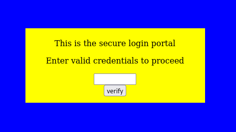
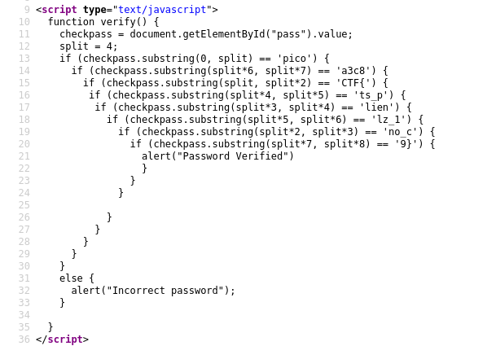

# :briefcase: dont-use-client-side

- **Difficulty**: `Easy`
- **Category**: `Web Exploitation`
- **Platform**: `picoCTF 2019`
- **Tag**: `None`
- **Author**: `Alex Fulton/Danny`
- **Date**: `12/06/2025`

---

# :pencil: Description

Can you break into this super secure portal? https://jupiter.challenges.picoctf.org/problem/37821/ [(link)](https://play.picoctf.org/practice/challenge/66) or http://jupiter.challenges.picoctf.org:37821

---

# :unlock: Solution

1. Access the link

    

2. View page source `>` There is a `verity` function used for password verification `>` Based on the `substring` function in JavaScript, we were able to extract the flag

    

---

# :white_flag: Flag

> picoCTF{no_clients_plz_1a3c89}

---

# :writing_hand: Notes

`substring()` method of String values returns the part of this string from the start index up to and excluding the end index, or to the end of the string if no end index is supplied.

---

# :books: Resources

[String.prototype.substring() - JavaScript | MDN](https://developer.mozilla.org/en-US/docs/Web/JavaScript/Reference/Global_Objects/String/substring)

---

# :hammer_and_wrench: Tools used

`None`

