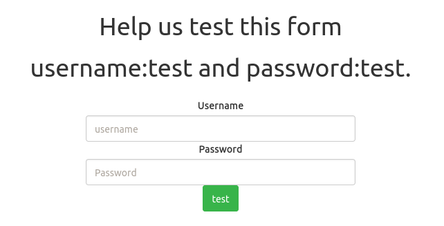
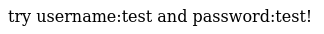
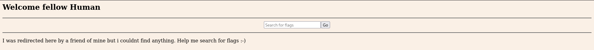
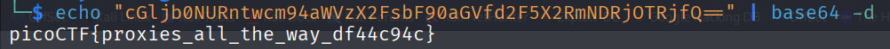

# :briefcase: findme

- **Difficulty**: `Medium`
- **Category**: `Web Exploitation`
- **Platform**: `picoCTF 2023`
- **Tag**: `None`
- **Author**: `Geoffrey Njogu`
- **Date**: `04/07/2025`

---

# :pencil: Description

Help us test the form by submiting the username as test and password as test! The website running [here](https://play.picoctf.org/practice/challenge/349).

---

# :unlock: Solution

1. Access the link

    

2. I tried entering the provided credentials: username `test` and password `test.` `>` Then I got this

    

3. So I went back and entered username `test` and password `test!` `>` After that, I was redirected here

    

4. I tried searching or doing anything that seemed relevant `>` I found nothing `>` I was redirected here by someone, so it's likely this wasn't the original page I landed on after logging in `>` So I tried going back to the previous pages and paid attention to the `URL` `>` These are the two URLs I went through

    

    

5. The id part seemed relevant, so I concatenated them and decoded it using Base64

    

---

# :white_flag: Flag

> picoCTF{proxies_all_the_way_df44c94c}

---

# :writing_hand: Notes

- `base64 -d, --decode` - decode data
- `Base64` is a group of similar binary-to-text encoding schemes that represent binary data in an ASCII string format by transforming it into a radix-64 representation

---

# :books: Resources

- [Base64 - MDN Web Docs Glossary: Definitions of Web-related terms | MDN](https://developer.mozilla.org/en-US/docs/Glossary/Base64)
- [Base64 - Wikipedia](https://en.wikipedia.org/wiki/Base64)

---

# :hammer_and_wrench: Tools used

`base64` - encode or decode FILE, or standard input, to standard output

