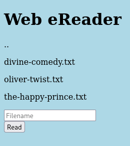
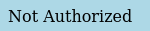
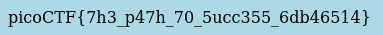

# :briefcase: Forbidden Paths

- **Difficulty**: `Medium`
- **Category**: `Web Exploitation`
- **Platform**: `picoCTF 2022`
- **Tag**: `None`
- **Author**: `LT 'syreal' Jones`
- **Date**: `05/07/2025`

---

# :pencil: Description

Can you get the flag? We know that the website files live in /usr/share/nginx/html/ and the flag is at /flag.txt but the website is filtering absolute file paths. Can you get past the filter to read the flag? Here's the [website](https://play.picoctf.org/practice/challenge/270).

---

# :unlock: Solution

1. Access the link

    

2. According to the description, we can't use an absolute path like `/flag.txt`

    

3. So I tried using a relative path to read the contents of `/flag.txt`, like `../../../../../../../../flag.txt`

    

---

# :white_flag: Flag

> picoCTF{7h3_p47h_70_5ucc355_6db46514}

---

# :writing_hand: Notes

- The `relative path` is specified differently in Linux and Windows, as the two OSes use / and \ to separate directories, respectively. 
- An `absolute path` is the location of a file or directory specified from the root directory. It represents the complete path from the start of the filesystem from the root directory.

---

# :books: Resources

[Absolute Path vs. Relative Path Explained | phoenixNAP KB](https://phoenixnap.com/kb/absolute-path-vs-relative-path)

---

# :hammer_and_wrench: Tools used

`None`

