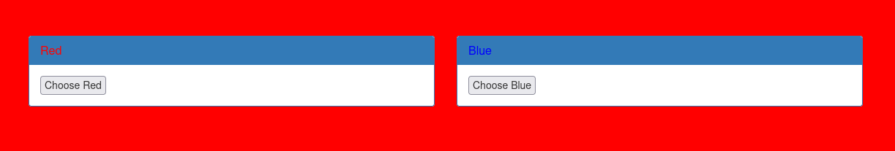
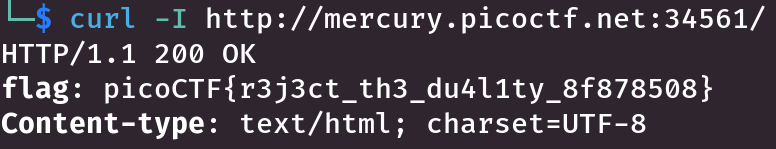

# :briefcase: GET aHEAD

- **Difficultly**: `Easy`
- **Category**: `Web Exploitation`
- **Platform**: `picoCTF 2021`
- **Tag**: `None`
- **Author**: `madStacks`
- **Date**: `12/06/2025`

---

# :pencil: Description

Find the flag being held on this server to get ahead of the competition [http://mercury.picoctf.net:34561/](https://play.picoctf.org/practice/challenge/132)

---

# :unlock: Solution

1. Access the link

    

2. I tried to fetch the header of the web request `>` I found it

    

---

# :white_flag: Flag

> picoCTF{r3j3ct_th3_du4l1ty_8f878508}

---

# :writing_hand: Notes

`curl -I, --head` - Fetch the headers only.

---

# :books: Resources

[curl](https://github.com/curl/curl/blob/master/docs/MANUAL.md)

---

# :hammer_and_wrench: Tools used

`curl` - transfer a URL

