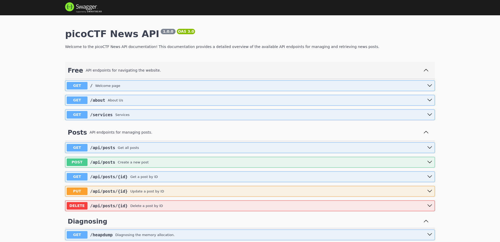
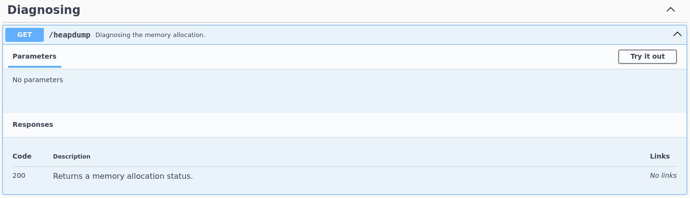
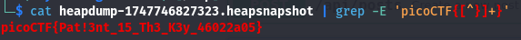

# :briefcase: head-dump

- **Difficultly**: `Easy`
- **Category**: `Web Exploitation`
- **Platform**: `picoCTF 2025`
- **Tag**: `browser_webshell_solvable`
- **Author**: `Prince Niyonshuti N.`
- **Date**: `20/05/2025`

---

# :pencil: Description

Welcome to the challenge! In this challenge, you will explore a web application and find an endpoint that exposes a file containing a hidden flag. The application is a simple blog website where you can read articles about various topics, including an article about API Documentation. Your goal is to explore the application and find the endpoint that generates files holding the server’s memory, where a secret flag is hidden. The website is running [picoCTF News](https://play.picoctf.org/practice/challenge/476).

---

# :unlock: Solution

1. Access the link

    

2. Go around the website `>` We can access the `#API Documentation`

    

3. Pay attention to the `Diagnosing` section

    

4. We have a `/heapdump` endpoint `>` Open the URL and download the file `>` Try finding some related words

    

---

# :white_flag: Flag

> picoCTF{Pat!3nt_15_Th3_K3y_46022a05}

---

# :writing_hand: Notes

A heap dump is a snapshot of the memory of a Java process at a certain point of time.

---

# :books: Resources

- [Java VisualVM - Browsing a Heap Dump](https://docs.oracle.com/javase/8/docs/technotes/guides/visualvm/heapdump.html)
- [Help - Eclipse Platform](https://help.eclipse.org/latest/index.jsp?topic=%2Forg.eclipse.mat.ui.help%2Fconcepts%2Fheapdump.html)

# :hammer_and_wrench: Tools used

`grep` - -E, --extended-regexp     PATTERNS are extended regular expressions

