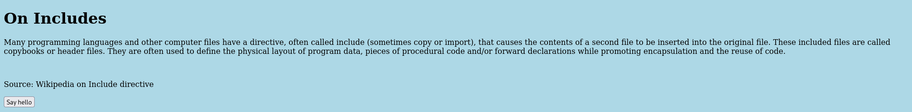
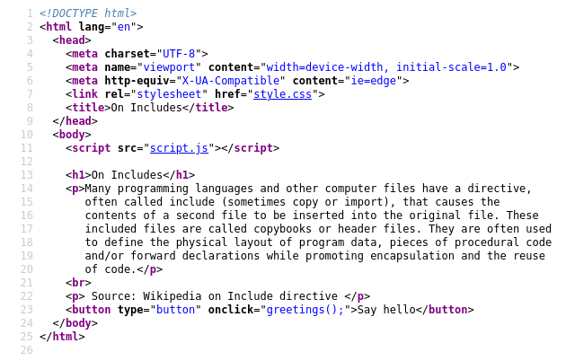
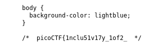
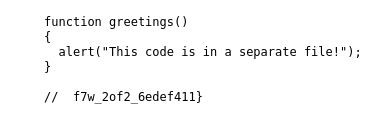

# :briefcase: Includes

- **Difficultly**: `Easy`
- **Category**: `Web Exploitation`
- **Platform**: `picoCTF 2022`
- **Tag**: `inspector`
- **Author**: `LT 'syreal' Jones`
- **Date**: `09/06/2025`

---

# :pencil: Description

Go to this [website](https://play.picoctf.org/practice/challenge/274) and see what you can discover.

---

# :unlock: Solution

1. Access the link

    

2. View page source `>` We have 2 suspicious files

    

3. Check `style.css` file `>` We found first part of the flag

    

4. Go back and check `script.js` file `>` We found the remaining part

    

---

# :white_flag: Flag

> picoCTF{1nclu51v17y_1of2_f7w_2of2_6edef411}

---

# :writing_hand: Notes

`None`

---

# :books: Resources

`None`

---

# :hammer_and_wrench: Tools used

`None`

