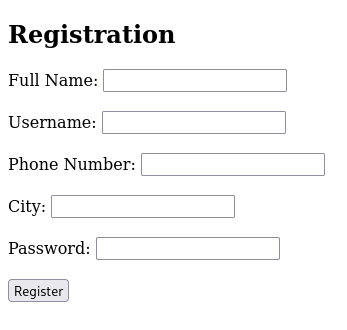
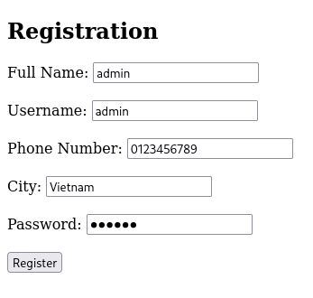
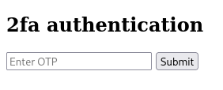
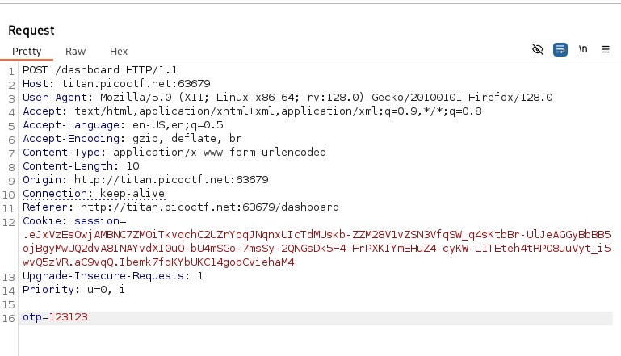
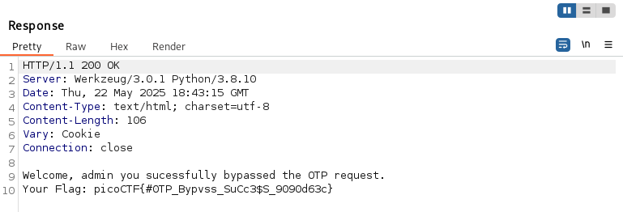

# :briefcase: IntroToBurp

- **Difficultly**: `Easy`
- **Category**: `Web Exploitation`
- **Platform**: `picoCTF 2024`
- **Tag**: `None`
- **Author**: `Nana Ama Atombo-Sackey & Sabine Gisagara`
- **Date**: `23/05/2025`

---

# :pencil: Description

Try [here](https://play.picoctf.org/practice/challenge/419) to find the flag

---

# :unlock: Solution

1. Access the link

    

2. Try to complete and submit the registration form

    

3. Then, a 2FA authentication form appears but we don't know the OTP `>` Go to BurpSuite

    

4. Enter any numbers `>` Intercept the request when submitting the OTP in BurpSuite `>` Send to Repeater

    

5. Remove the `otp` parameter and send `>` We got it

    

---

# :white_flag: Flag

> picoCTF{#0TP_Bypvss_SuCc3$S_9090d63c}

---

# :writing_hand: Notes

- If you don't know what the value is, try removing it.
- Keep two blank lines in the request.

---

# :books: Resources

- [Burp Suite documentation - PortSwigger](https://portswigger.net/burp/documentation)
- [Intercepting HTTP traffic with Burp Proxy - PortSwigger](https://portswigger.net/burp/documentation/desktop/getting-started/intercepting-http-traffic)
- [Burp Repeater - PortSwigger](https://portswigger.net/burp/documentation/desktop/tools/repeater)

---

# :hammer_and_wrench: Tools used

`BurpSuite`

