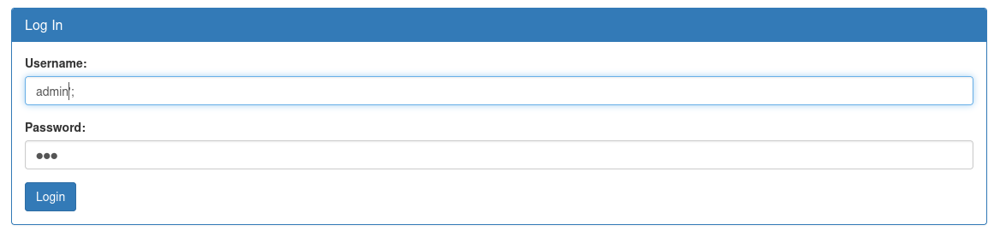

# :briefcase: Irish-Name-Repo 1

- **Difficulty**: `Medium`
- **Category**: `Web Exploitation`
- **Platform**: `picoCTF 2019`
- **Tag**: `None`
- **Author**: `Chris Hensler`
- **Date**: `23/06/2025`

---

# :pencil: Description

There is a website running at https://jupiter.challenges.picoctf.org/problem/33850/ [(link)](https://play.picoctf.org/practice/challenge/80) or http://jupiter.challenges.picoctf.org:33850. Do you think you can log us in? Try to see if you can login!

---

# :unlock: Solution

1. Access the link

    

2. After browsing around the website, I accessed the `Support` page and found this `>` An SQL error was detected, so I navigated to the login page and tried entering some payloads

    

3. I tried entering username `admin';` and password `123`

    

4. Okay, It's here

    

---

# :white_flag: Flag

> picoCTF{s0m3_SQL_f8adf3fb}

---

# :writing_hand: Notes

“Regular” SQL injection is also called `in-band SQLi` because the attacker is able to receive results in the same way they performed the attack itself. A typical example would be to submit a web form with an SQLi payload and then see the returned database records on the same page.

---

# :books: Resources

- [What is SQL Injection (SQLi) and How to Prevent Attacks](https://www.acunetix.com/websitesecurity/sql-injection/)
- [What is SQL Injection? Tutorial & Examples | Web Security Academy](https://portswigger.net/web-security/sql-injection)

---

# :hammer_and_wrench: Tools used

`None`

