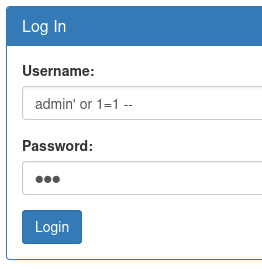
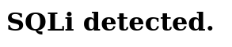
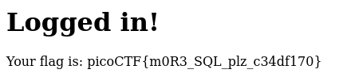

# :briefcase: Irish-Name-Repo 2

- **Difficulty**: `Medium`
- **Category**: `Web Exploitation`
- **Platform**: `picoCTF 2019`
- **Tag**: `None`
- **Author**: `Xingyang Pan`
- **Date**: `23/06/2025`

---

# :pencil: Description

There is a website running at https://jupiter.challenges.picoctf.org/problem/53751/ [(link)](https://play.picoctf.org/practice/challenge/59). Someone has bypassed the login before, and now it's being strengthened. Try to see if you can still login! or http://jupiter.challenges.picoctf.org:53751

---

# :unlock: Solution

1. Access the link

    

2. According to the description, the website has been more strongly secured `>` I tried the payload `admin' or 1=1 --`

    

    And I got this

    

3. It seems the website filters out some dangerous characters, but that’s nothing compared to the payload I used in part 1 `admin';` `>` Its' here

    

---

# :white_flag: Flag

> picoCTF{m0R3_SQL_plz_c34df170}

---

# :writing_hand: Notes

“Regular” SQL injection is also called `in-band SQLi` because the attacker is able to receive results in the same way they performed the attack itself. A typical example would be to submit a web form with an SQLi payload and then see the returned database records on the same page.

---

# :books: Resources

- [payloadbox/sql-injection-payload-list: 🎯 SQL Injection Payload List](https://github.com/payloadbox/sql-injection-payload-list)
- [What is SQL Injection (SQLi) and How to Prevent Attacks](https://www.acunetix.com/websitesecurity/sql-injection/)
- [What is SQL Injection? Tutorial & Examples | Web Security Academy](https://portswigger.net/web-security/sql-injection)

---

# :hammer_and_wrench: Tools used

`None`

