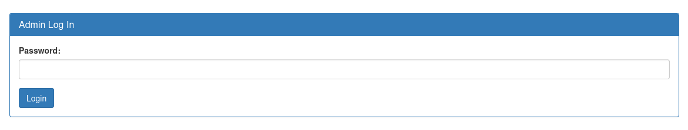
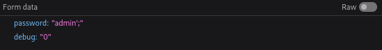
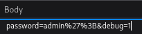
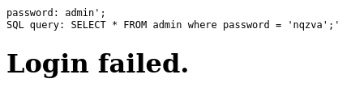
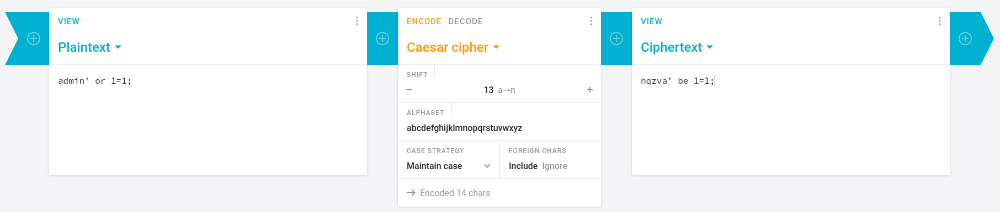
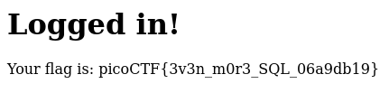

# :briefcase: Irish-Name-Repo 3

- **Difficulty**: `Medium`
- **Category**: `Web Exploitation`
- **Platform**: `picoCTF 2019`
- **Tag**: `None`
- **Author**: `Xingyang Pan`
- **Date**: `26/06/2025`

---

# :pencil: Description

There is a secure website running at https://jupiter.challenges.picoctf.org/problem/29132/ [(link)](https://play.picoctf.org/practice/challenge/8) or http://jupiter.challenges.picoctf.org:29132. Try to see if you can login as admin!

---

# :unlock: Solution

1. Access the link

    

2. I proceeded to the login page as in the previous parts, but this time, only the password input field was available

    

3. I started testing a few payloads like `admin';`, `admin' OR 1=1;`,... but But it was unsuccessful

    

4. So I opened DevTools to inspect the request

    

    I noticed the `debug` parameter was set to `0` `>` Perhaps `0` means false, so I changed its value to `1`, which likely means true

    

    And send it

    

5. The payload I entered was `admin';` but it was transformed into `nqzva';` `>` Since the letters were shifted, it’s likely related to the `Caesar Cipher` `>` So I tried this

    ```python
    print(ord('n') - ord('a')) # Output: 13
    ```

6. The letters were shifted by 13 positions `>` So I tried a more precise payload `admin' OR 1=1;` and encoded it

    

7. Copy it and paste it into the password field `>` It's here

    

---

# :white_flag: Flag

> picoCTF{3v3n_m0r3_SQL_06a9db19}

---

# :writing_hand: Notes

- The `Caesar Cipher` is one of the simplest and oldest methods of encrypting messages, named after Julius Caesar, who reportedly used it to protect his military communications.
- `ord()` - Given a string representing one Unicode character, return an integer representing the Unicode code point of that character. For example, ord('a') returns the integer 97 and ord('\u2020') returns 8224. This is the inverse of chr().

---

# :books: Resources

- [Caesar Cipher in Cryptography - GeeksforGeeks](https://www.geeksforgeeks.org/caesar-cipher-in-cryptography/)
- [Built-in Functions - Python 3.4.10 documentation](https://docs.python.org/3.4/library/functions.html#ord)

---

# :hammer_and_wrench: Tools used

[Caesar cipher: Encode and decode online - cryptii](https://cryptii.com/pipes/caesar-cipher)

