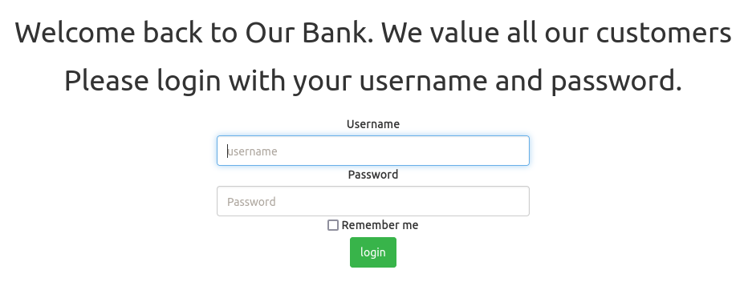
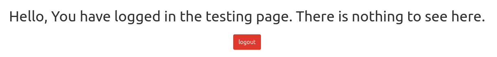
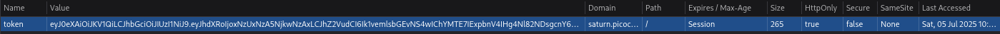
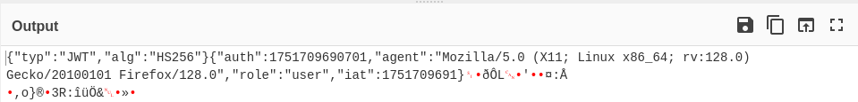
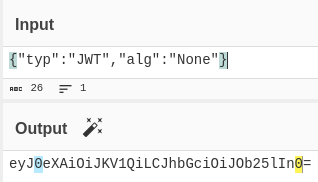
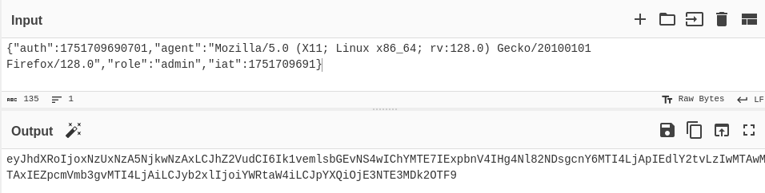
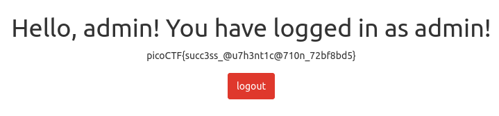

# :briefcase: JAuth

- **Difficulty**: `Medium`
- **Category**: `Web Exploitation`
- **Platform**: `picoGym Exclusive`
- **Tag**: `None`
- **Author**: `Geoffrey Njogu`
- **Date**: `05/07/2025`

---

# :pencil: Description

Most web application developers use third party components without testing their security. Some of the past affected companies are:

    Equifax (a US credit bureau organization) - breach due to unpatched Apache Struts web framework CVE-2017-5638
    Mossack Fonesca (Panama Papers law firm) breach - unpatched version of Drupal CMS used
    VerticalScope (internet media company) - outdated version of vBulletin forum software used

Can you identify the components and exploit the vulnerable one? The website is running [here](https://play.picoctf.org/practice/challenge/236). Can you become an `admin`? You can login as `test` with the password `Test123!` to get started.

---

# :unlock: Solution

1. Access the link

    

2. According to the given information, I logged in using the username `test` and password `Test123!` `>` I got this

    

3. After a successful login, I noticed that a cookie was set

    

    It looked like a JWT, so I tried decoding it with Base64

    

4. I did some research on exploiting JWT authentication, and here’s what I found

    First, take the first segment and change the JWT `alg` to `None` `>` Encode it back using Base64 (omit the = padding)

    

    Next, take the second segment and change the `role` to `admin` `>` Encode it back using Base64

    

5. We'll combine the two segments and add a dot at the end (make sure to separate the two parts with a `.`) `>` Modify the cookie value and reload the page

    

---

# :white_flag: Flag

> picoCTF{succ3ss_@u7h3nt1c@710n_72bf8bd5}

---

# :writing_hand: Notes

- The last character (= sign) is added only as a complement (padding) in the final process of encoding a message with a special number of characters.
- JSON Web Tokens consist of three parts separated by dots (.)

---

# :books: Resources

- [encoding - Why does a base64 encoded string have an = sign at the end - Stack Overflow](https://stackoverflow.com/questions/6916805/why-does-a-base64-encoded-string-have-an-sign-at-the-end)
- [JSON Web Token Attacks And Vulnerabilities | Acunetix](https://www.acunetix.com/blog/articles/json-web-token-jwt-attacks-vulnerabilities/)
- [JSON Web Token - Wikipedia](https://en.wikipedia.org/wiki/JSON_Web_Token)
- [SON Web Token Introduction - jwt.io](https://jwt.io/introduction)

---

# :hammer_and_wrench: Tools used

[CyberChef](https://gchq.github.io/CyberChef/)

