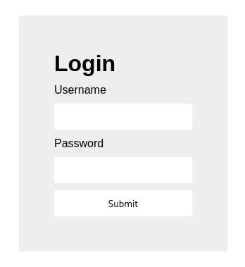
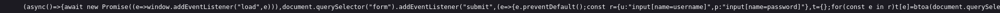
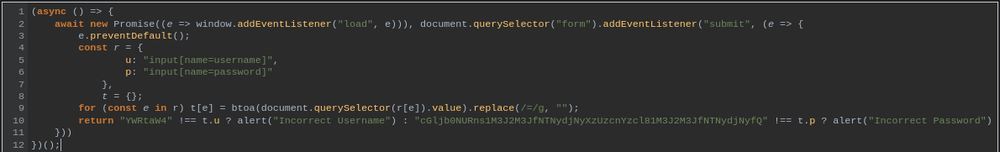
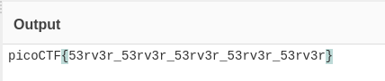

# :briefcase: login

- **Difficulty**: `Medium`
- **Category**: `Web Exploitation`
- **Platform**: `picoMini by redpwn`
- **Tag**: `None`
- **Author**: `BrownieInMotion`
- **Date**: `23/06/2025`

---

# :pencil: Description

My dog-sitter's brother made this website but I can't get in; can you help? login.mars.picoctf.net [link](https://play.picoctf.org/practice/challenge/200)

---

# :unlock: Solution

1. Access the link

    

2. After exploring the website, I found the code in the `index.js` file obfuscated, so I reformatted it to make it more readable

    

    

3. I noticed a string that looked like Base64, so I decoded it `>` It's here

    

---

# :white_flag: Flag

> picoCTF{53rv3r_53rv3r_53rv3r_53rv3r_53rv3r}

---

# :writing_hand: Notes

`Base64` is a group of similar binary-to-text encoding schemes that represent binary data in an ASCII string format by transforming it into a radix-64 representation.

---

# :books: Resources

[Base64 - Glossary | MDN](https://developer.mozilla.org/en-US/docs/Glossary/Base64)

---

# :hammer_and_wrench: Tools used

- [From Base64 - CyberChef](https://gchq.github.io/CyberChef/#recipe=From_Base64('A-Za-z0-9%2B/%3D',true,false))
- [Online JavaScript beautifier](https://beautifier.io/)

