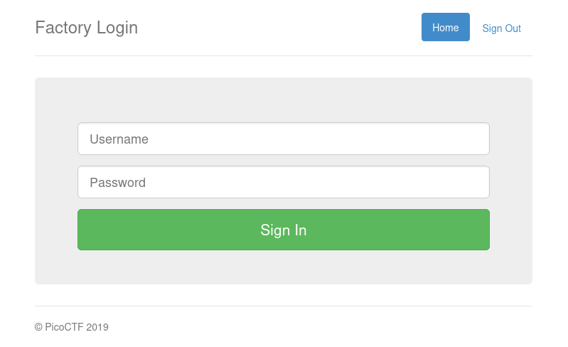
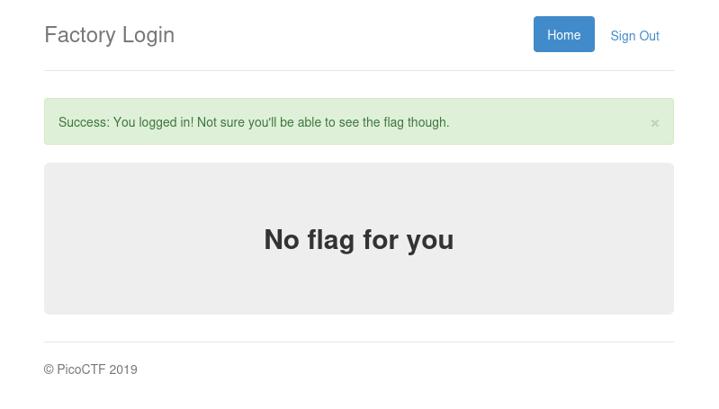
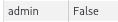
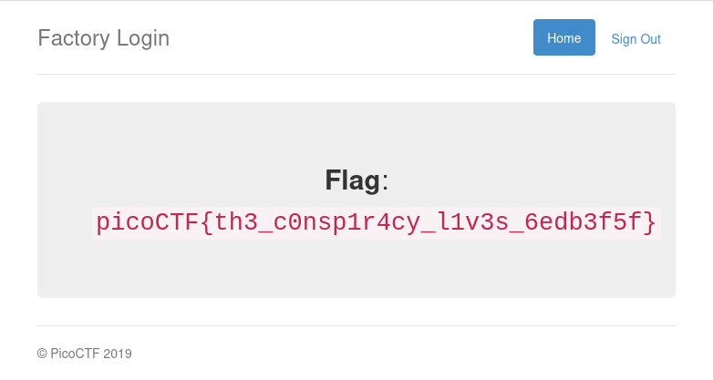

# :briefcase: logon

- **Difficulty**: `Easy`
- **Category**: `Web Exploitation`
- **Platform**: `picoCTF 2019`
- **Tag**: `None`
- **Author**: `bobson`
- **Date**: `12/06/2025`

---

# :pencil: Description

The factory is hiding things from all of its users. Can you login as Joe and find what they've been looking at? https://jupiter.challenges.picoctf.org/problem/15796/ [(link)](https://play.picoctf.org/practice/challenge/46) or http://jupiter.challenges.picoctf.org:15796

---

# :unlock: Solution

1. Access the link

    

2. I tried logging in with a random username and password, and I received a message

    

3. While navigating around the website, I noticed a cookie named admin was set to False after logging in

    

4. I tried changing the value from `False` to `True` and reloaded the page`>` I found it

    

---

# :white_flag: Flag

> picoCTF{th3_c0nsp1r4cy_l1v3s_6edb3f5f}

---

# :writing_hand: Notes

`None`

---

# :books: Resources

`None`

---

# :hammer_and_wrench: Tools used

`None`

