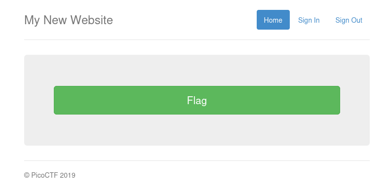
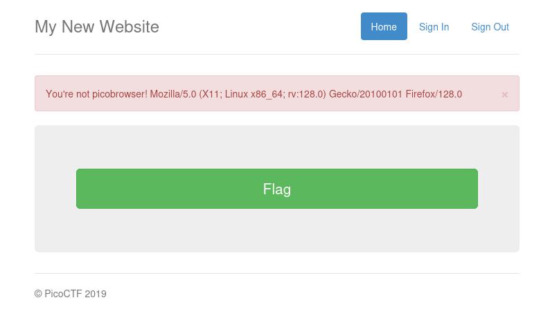
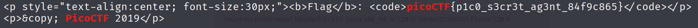

# :briefcase: picobrowser

- **Difficultly**: `Medium`
- **Category**: `Web Exploitation`
- **Platform**: `picoCTF 2019`
- **Tag**: `None`
- **Author**: `Archit`
- **Date**: `21/06/2025`

---

# :pencil: Description

This website can be rendered only by picobrowser, go and catch the flag! https://jupiter.challenges.picoctf.org/problem/28921/ [(link)](https://play.picoctf.org/practice/challenge/9) or http://jupiter.challenges.picoctf.org:28921

---

# :unlock: Solution

1. Access the link

    

2. I tried clicking the `Flag` button and received a message here

    

3. `You're not picobrowser` it seems I need to use `picobrowser` to access this page `>` I used this command

    ```console
    curl -A "picobrowser" "https://jupiter.challenges.picoctf.org/problem/28921" | grep -i "picoCTF"
    ```

4. I found it

    

---

# :white_flag: Flag

> picoCTF{p1c0_s3cr3t_ag3nt_84f9c865}

---

# :writing_hand: Notes

- `-A, --user-agent` - Specify the User-Agent string to send to the HTTP server.
- The HTTP `User-Agent` request header is a characteristic string that lets servers and network peers identify the application, operating system, vendor, and/or version of the requesting user agent.

---

# :books: Resources

[User-Agent header - HTTP | MDN](https://developer.mozilla.org/en-US/docs/Web/HTTP/Reference/Headers/User-Agent)

---

# :hammer_and_wrench: Tools used

`curl` - transfer a URL

