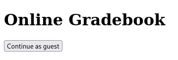
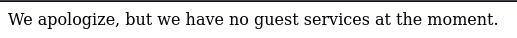
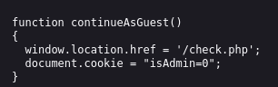
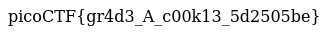

# :briefcase: Power Cookie

- **Difficulty**: `Medium`
- **Category**: `Web Exploitation`
- **Platform**: `picoCTF 2022`
- **Tag**: `cookie`
- **Author**: `LT 'syreal' Jones`
- **Date**: `04/07/2025`

---

# :pencil: Description

Can you get the flag? Go to this [website](https://play.picoctf.org/practice/challenge/288) and see what you can discover.

---

# :unlock: Solution

1. Access the link

    

2. I tried clicking `Continue as guest` and got this

    

3. I browsed around the website and checked the `check.js` file `>` I noticed a verification cookie being set when the `Continue as guest` button is clicked

    

4. I tried changing it to `1` `>` There it is

    

---

# :white_flag: Flag

> picoCTF{gr4d3_A_c00k13_5d2505be}

---

# :writing_hand: Notes

`None`

---

# :books: Resources

`None`

---

# :hammer_and_wrench: Tools used

`None`

