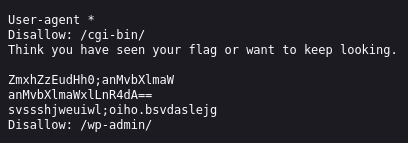
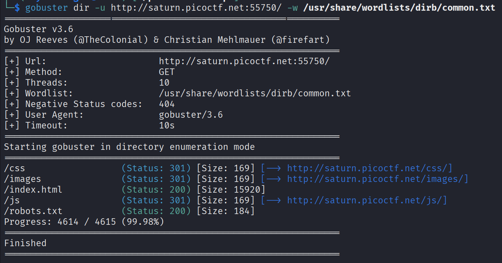
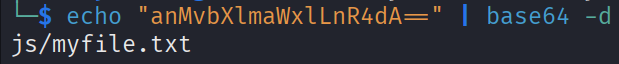
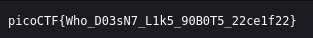

# :briefcase: Roboto Sans

- **Difficulty**: `Medium`
- **Category**: `Web Exploitation`
- **Platform**: `picoCTF 2022`
- **Tag**: `None`
- **Author**: `Mubarak Mikail`
- **Date**: `05/07/2025`

---

# :pencil: Description

The flag is somewhere on this web application not necessarily on the website. Find it. Check [this](https://play.picoctf.org/practice/challenge/291) out.

---

# :unlock: Solution

1. Access the link

    

2. The challenge name hinted at something related to robots, so I checked `robots.txt`

    

    Alternatively, we can use tools like `gobuster` to discover directories and paths

    

3. There was a Base64-encoded string, so I decoded it

    

4. We have a path `>` Let's access it

    

---

# :white_flag: Flag

> picoCTF{Who_D03sN7_L1k5_90B0T5_22ce1f22}

---

# :writing_hand: Notes

- `base64 -d, --decode` - decode data
- `Base64` is a group of similar binary-to-text encoding schemes that represent binary data in an ASCII string format by transforming it into a radix-64 representation
- `gobuster dir` - the classic directory brute-forcing mode
- `gobuster -w, --wordlist string` - Path to the wordlist
- `gobuster -u` - URL

---

# :books: Resources

- [Base64 - MDN Web Docs Glossary: Definitions of Web-related terms | MDN](https://developer.mozilla.org/en-US/docs/Glossary/Base64)
- [Base64 - Wikipedia](https://en.wikipedia.org/wiki/Base64)

---

# :hammer_and_wrench: Tools used

`base64` - encode or decode FILE, or standard input, to standard output
`gobuster` - Directory/file & DNS busting tool written in Go

