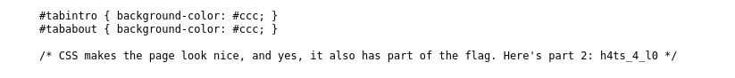
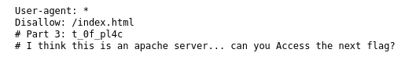
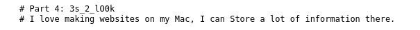

# :briefcase: Scavenger Hunt

- **Difficulty**: `Easy`
- **Category**: `Web Exploitation`
- **Platform**: `picoCTF 2021`
- **Tag**: `None`
- **Author**: `madStacks`
- **Date**: `11/06/2025`

---

# :pencil: Description

There is some interesting information hidden around this site [http://mercury.picoctf.net:55079/](https://play.picoctf.org/practice/challenge/161). Can you find it?

---

# :unlock: Solution

1. Access the link

    

2. View page source `>` I found the first part of the flag

    

3. I continued checking other files

    I found the second part of the flag in the `mycss.css` file

    

    And I found a hint about the second part of the flag in the `myjs.js` file

    

4. After some research, I tried accessing the `robots.txt` file `>` I found a new hint and the third part of the flag

    

5. From the hint, it seemed there might be a configuration file of the Apache server `>` The `.htaccess` file could be one of them `>` I found a new hint and the fourth part of the flag

    

6. From the hint, I tried opening the `.DS_Store` file because it's a hidden file on macOS `>` And I found the last part of the flag

    

---

# :white_flag: Flag

> picoctf{th4ts_4_l0t_0f_pl4c3s_2_lo0k_74cceb07}

---

# :writing_hand: Notes

- `robots.txt` file is a simple text file that provides instructions to web crawlers
- `.DS_Store` is a hidden file created by macOS Finder in every directory open
- `.htaccess` is a configuration file used on Apache web servers

---

# :books: Resources

- [How Can I keep Google From Indexing My Website? - ExertPro LLC](https://exertpro.com/how-can-i-keep-google-from-indexing-my-website/)
- [Configuration Files - Apache HTTP Server Version 2.4](https://httpd.apache.org/docs/2.4/configuring.html)

---

# :hammer_and_wrench: Tools used

`None`

