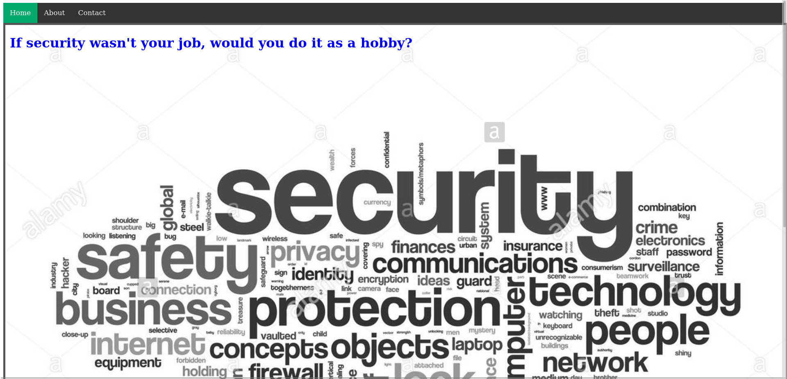
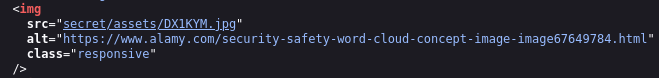
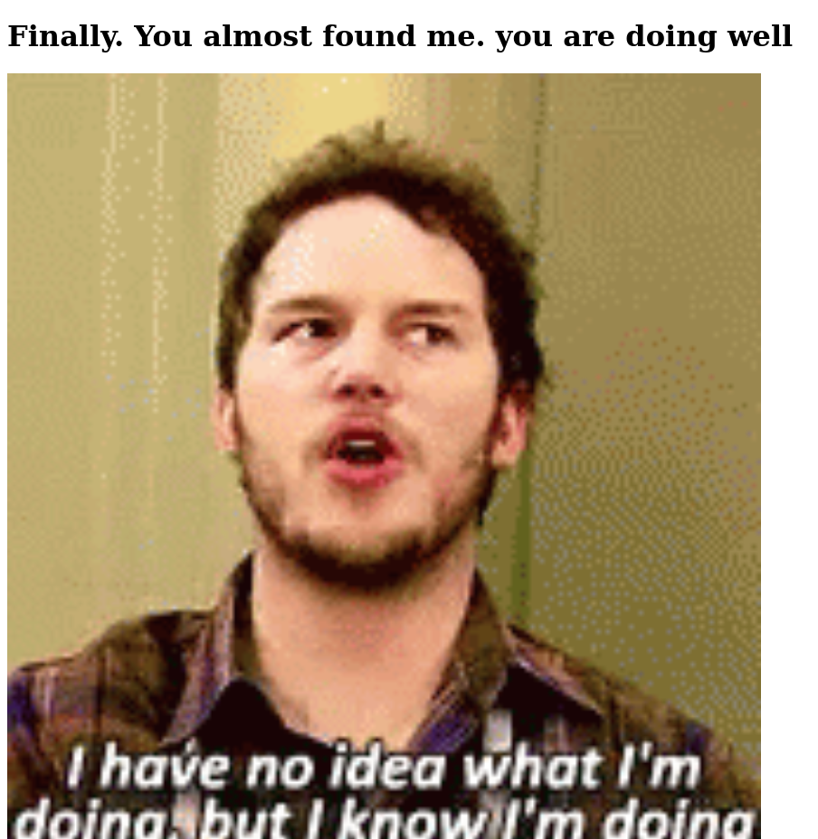
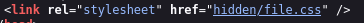
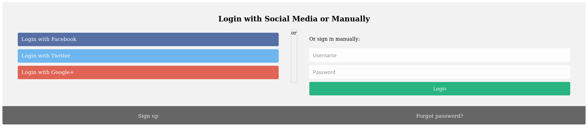
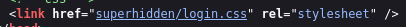
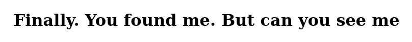
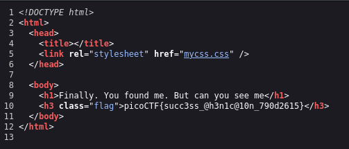

# :briefcase: Secrets

- **Difficulty**: `Medium`
- **Category**: `Web Exploitation`
- **Platform**: `picoCTF 2022`
- **Tag**: `None`
- **Author**: `Geoffrey Njogu`
- **Date**: `04/07/2025`

---

# :pencil: Description

We have several pages hidden. Can you find the one with the flag? The website is running [here](https://play.picoctf.org/practice/challenge/296).

---

# :unlock: Solution

1. Access the link

    

2. I explored the website for a bit and then viewed the page source `>` I noticed this line

    

3. There was a `secret/` directory, so I accessed it

    

    I opened the page source and once again noticed this line

    

    Accessing the `hidden/` directory `>` And there we have a login page

    

4. I tried entering a few things, but nothing special happened `>` I opened the page source and noticed this line

    

5. There's another directory named `superhidden/` `>` Let's access it

    

6. Opened the page source again `>` There it is

    

---

# :white_flag: Flag

> picoCTF{succ3ss_@h3n1c@10n_790d2615}

---

# :writing_hand: Notes

`None`

---

# :books: Resources

`None`

---

# :hammer_and_wrench: Tools used

`None`

