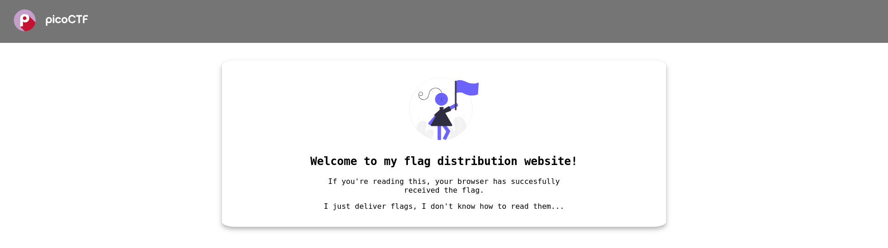
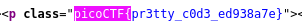

# :briefcase: Unminify

- **Difficultly**: `Easy`
- **Category**: `Web Exploitation`
- **Platform**: `picoCTF 2024`
- **Tag**: `obfuscation` `browser_webshell_solvable` `minification`
- **Author**: `Jeffery John`
- **Date**: 21/05/2025`

---

# :pencil: Description

I don't like scrolling down to read the code of my website, so I've squished it. As a bonus, my pages load faster! Browse [here](https://play.picoctf.org/practice/challenge/426), and find the flag!

---

# :unlock: Solution

1. Access the link

    

2. View page source `>` Try find some related words

    

---

# :white_flag: Flag

> picoCTF{pr3tty_c0d3_ed938a7e}

---

# :writing_hand: Notes

None

---

# :books: Resources

None

---

# :hammer_and_wrench: Tools used

`Find bar` of browser

