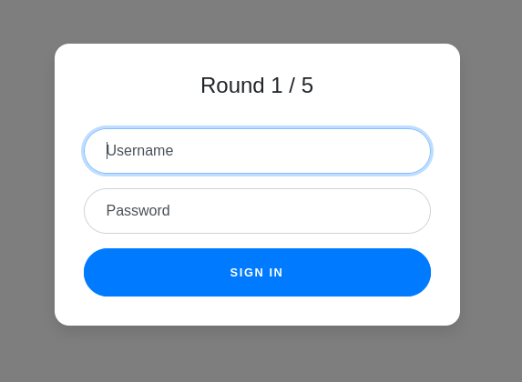
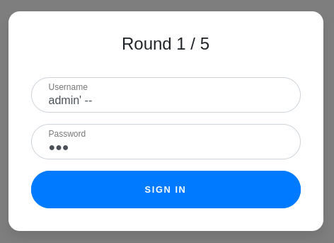
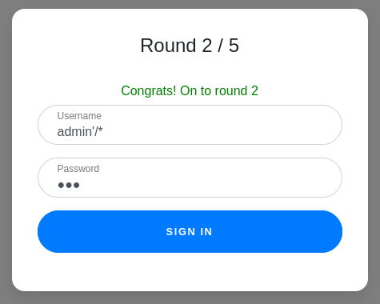
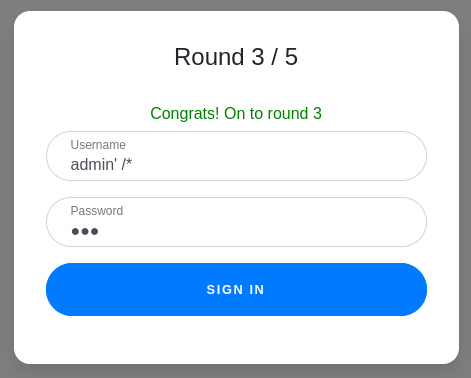
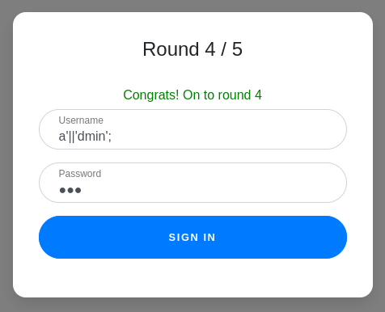
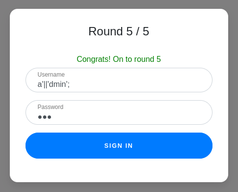
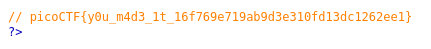

# :briefcase: Web Gauntlet

- **Difficulty**: `Medium`
- **Category**: `Web Exploitation`
- **Platform**: `picoCTF 2020 Mini-Competition`
- **Tag**: `None`
- **Author**: `madStacks`
- **Date**: `22/06/2025`

---

# :pencil: Description

Can you beat the filters? Log in as admin http://jupiter.challenges.picoctf.org:44979/ http://jupiter.challenges.picoctf.org:44979/filter.php [link](https://play.picoctf.org/practice/challenge/88)

---

# :unlock: Solution

1. Access the link

    

2. Access the `filter.php` file `>` The characters not used in each round will appear here and must be logged in with the username `admin`

    `Round 1: or` `>` I used the payload `admin' --`

    

    `Round2: or and like = --` `>` Since `--` is no longer allowed, we'll use another character that can be used to comment out SQL statements `>` I used the payload `admin'/*`

    

    `Round3: or and = like > < --` `>` I tried using the payload from the previous round and it work `>` Alternatively, we can use the payload `admin';` since `;` is a statement terminator in SQL

    

    `Round4: or and = like > < -- admin` `>` I can no longer use `admin` directly, but we can concatenate characters using `||` `>` I used the payload `a'||'dmin';`

    

    `Round5: or and = like > < -- union admin` `>` Let's use the payload from the previous round

    

    And I received a message `Congrats! You won! Check out filter.php`

3. Reload the `filter.php` page `>` I found it

    

---

# :white_flag: Flag

> picoCTF{y0u_m4d3_1t_16f769e719ab9d3e310fd13dc1262ee1}

---

# :writing_hand: Notes

`None`

---

# :books: Resources

[picoCTF-Writeups/picoCTF_2020/Web_Exploitation/Web_Gauntlet.md at main · Cajac/picoCTF-Writeups](https://github.com/Cajac/picoCTF-writeups/blob/main/picoCTF_2020/Web_Exploitation/Web_Gauntlet.md)

---

# :hammer_and_wrench: Tools used

`None`

