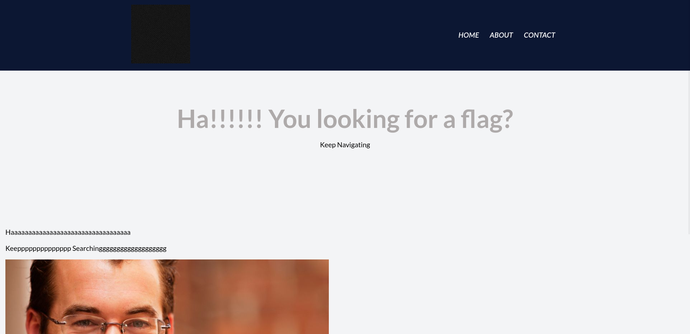
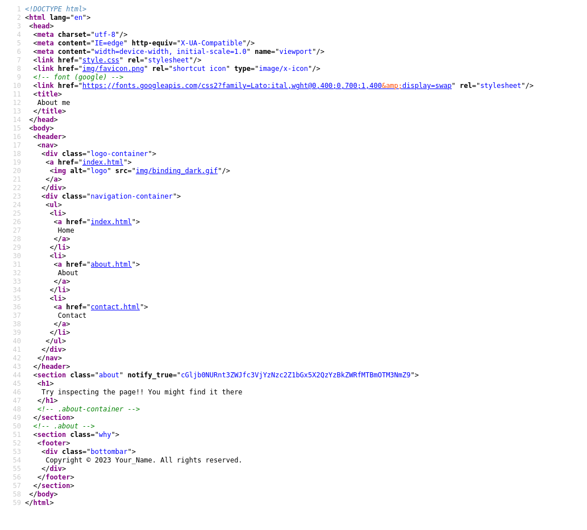
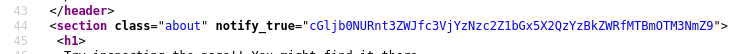
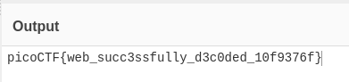

# :briefcase: WebDecode

- **Difficulty**: `Easy`
- **Category**: `Web Exploitation`
- **Platform**: `picoCTF 2024`
- **Tag**: `browser_webshell_solvable`
- **Author**: `Nana Ama Atombo-Sackey`
- **Date**: `21/05/2025`

---

# :pencil: Description

Do you know how to use the web inspector? Start searching [here](https://play.picoctf.org/practice/challenge/427) to find the flag

---

# :unlock: Solution

1. Access the link

    

2. View page source `>` Navigate to the source of `about.html` file

    

3. Pay attention to the `<section>` tag with the `notify_true` attribute

    

4. Here, we have a Base64-encoded string here `>` Decode it

    

---

# :white_flag: Flag

> picoCTF{web_succ3ssfully_d3c0ded_10f9376f}

---

# :writing_hand: Notes

- Inspect all the website's source files.
- Base64 is a group of similar binary-to-text encoding schemes that represent binary data in an ASCII string format by transforming it into a radix-64 representation.

---

# :books: Resources

- [Base64 - Wikipedia](https://en.wikipedia.org/wiki/Base64)
- [Base64 - MDN Web Docs Glossary: Definitions of Web-related terms | MDN](https://developer.mozilla.org/en-US/docs/Glossary/Base64)

---

# :hammer_and_wrench: Tools used

[From Base64 - CyberChef](https://gchq.github.io/CyberChef/#recipe=From_Base64('A-Za-z0-9%2B/%3D',true,false))

