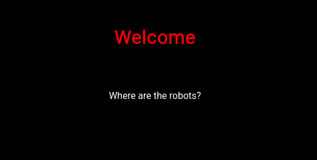
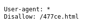
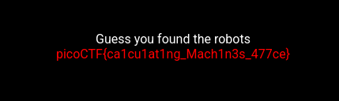

# :briefcase: where are the robots

- **Difficulty**: `Easy`
- **Category**: `Web Exploitation`
- **Platform**: `picoCTF 2019`
- **Tag**: `None`
- **Author**: `zaratec/Danny`
- **Date**: `14/06/2025`

---

# :pencil: Description

Can you find the robots? https://jupiter.challenges.picoctf.org/problem/36474/ [(link)](https://play.picoctf.org/practice/challenge/4) or http://jupiter.challenges.picoctf.org:36474

---

# :unlock: Solution

1. Access the link

    

2. I checked the `robots.txt` file and found this

    

3. It seems that the `/477ce.html` path is not publicly accessible `>` I accessed the `/477ce.html` URL and found it

    

---

# :white_flag: Flag

>  picoCTF{ca1cu1at1ng_Mach1n3s_477ce}

---

# :writing_hand: Notes

`robots.txt` is the filename used for implementing the Robots Exclusion Protocol, a standard used by websites to indicate to visiting web crawlers and other web robots which portions of the website they are allowed to visit.

---

# :books: Resources

- [robots.txt - Wikipedia](https://en.m.wikipedia.org/wiki/Robots.txt)
- [What is robots.txt? | Robots.txt file guide | Cloudflare](https://www.cloudflare.com/learning/bots/what-is-robots-txt/)

---

# :hammer_and_wrench: Tools used

`None`

