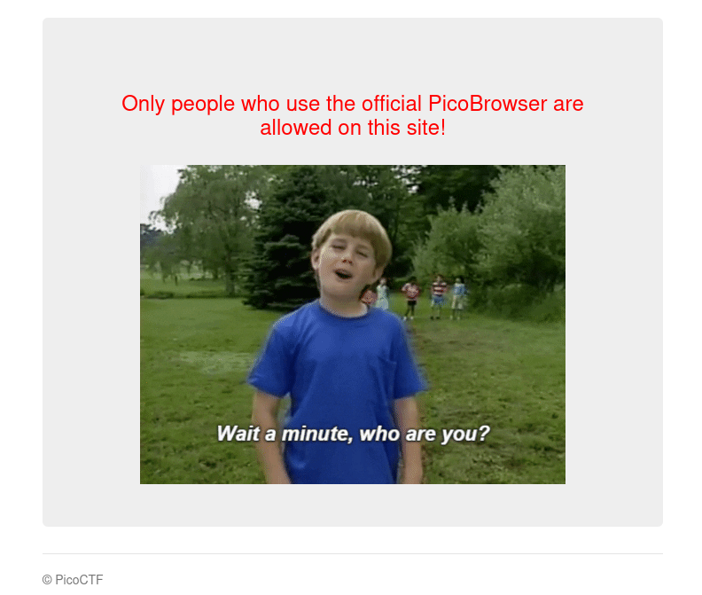
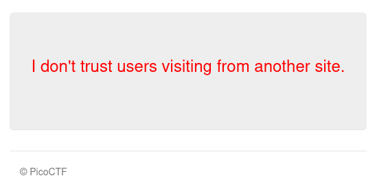
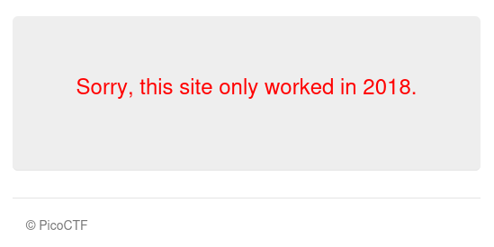
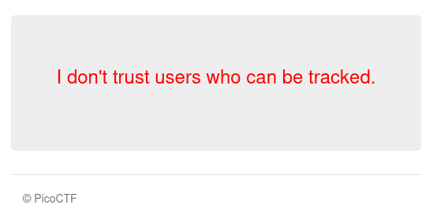
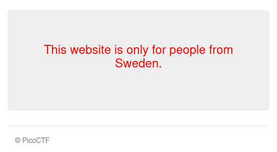
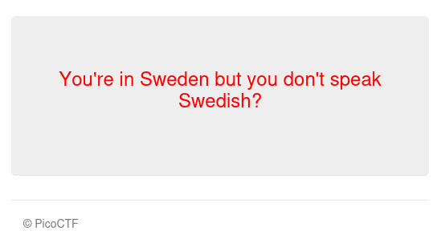
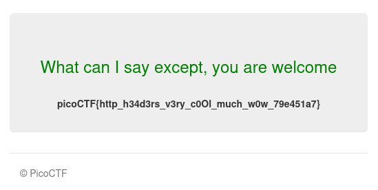

# :briefcase: Who are you?

- **Difficulty**: `Medium`
- **Category**: `Web Exploitation`
- **Platform**: `picoCTF 2021`
- **Tag**: `None`
- **Author**: `madStacks`
- **Date**: `22/06/2025`

---

# :pencil: Description

Let me in. Let me iiiiiiinnnnnnnnnnnnnnnnnnnn http://mercury.picoctf.net:34588/ [(link)](https://play.picoctf.org/practice/challenge/142)

---

# :unlock: Solution

1. Access the link

    

2. I received a message suggesting that I need to use `PicoBrowser` to access this website `>` Then I opened `DevTools` and started

    First, I needed to change the `User-Agent` to `PicoBrowser`

    

    I got this

    

    Second, it seems I need to access the page directly from their own website `>` Let's use the `Referer` header

    

    I got this

    

    Third, it seems I need to go back in time `>` Let's use the `Date` header

    

    I got this

    

    Fourth, it seems I need to avoid being tracked `>` Let's use the 'DNT' header

    

    I got this

    

    Fifth, it seems I need to be in Sweden `>` Let's use the `X-Forwarded-For` header and ip address from Sweden

    

    I got this

    

    Sixth, it seems I need to use the Swedish language `>` Let's use the `Accept-Language` with `sv` value

    

    And I got this

    

---

# :white_flag: Flag

> picoCTF{http_h34d3rs_v3ry_c0Ol_much_w0w_79e451a7}

---

# :writing_hand: Notes

- The HTTP `User-Agent` request header is a characteristic string that lets servers and network peers identify the application, operating system, vendor, and/or version of the requesting user agent.
- The HTTP `Referer` request header contains the absolute or partial address from which a resource has been requested. 
- The HTTP `Date` request and response header contains the date and time at which the message originated.
- The HTTP `DNT` (Do Not Track) request header indicates the user's tracking preference. It lets users indicate whether they would prefer privacy rather than personalized content.
- The HTTP `X-Forwarded-For` (XFF) request header is a de-facto standard header for identifying the originating IP address of a client connecting to a web server through a proxy server.
- The HTTP `Accept-Language` request header indicates the natural language and locale that the client prefers.

---

# :books: Resources

- [User-Agent header - HTTP | MDN](https://developer.mozilla.org/en-US/docs/Web/HTTP/Reference/Headers/User-Agent)
- [Referer header - HTTP | MDN](https://developer.mozilla.org/en-US/docs/Web/HTTP/Reference/Headers/Referer)
- [Date header - HTTP | MDN](https://developer.mozilla.org/en-US/docs/Web/HTTP/Reference/Headers/Date)
- [DNT header - HTTP | MDN](https://developer.mozilla.org/en-US/docs/Web/HTTP/Reference/Headers/DNT)
- [X-Forwarded-For header - HTTP | MDN](https://developer.mozilla.org/en-US/docs/Web/HTTP/Reference/Headers/X-Forwarded-For)
- [Accept-Language header - HTTP | MDN](https://developer.mozilla.org/en-US/docs/Web/HTTP/Reference/Headers/Accept-Language)
- [Sweden | Public DNS Server](https://publicdnsserver.com/sweden/)
- [Language code: sv](https://localizely.com/language-code/sv/)

---

# :hammer_and_wrench: Tools used

`None`
